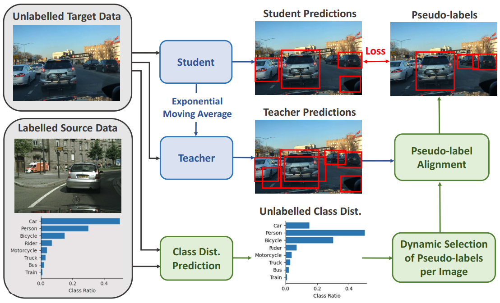
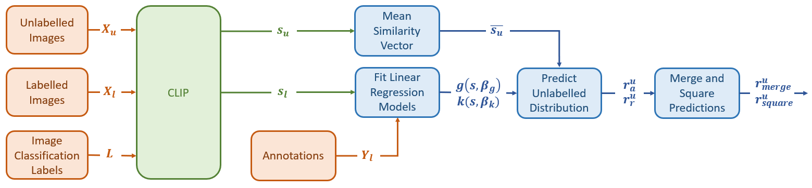

# Class Distribution Prediction for Reliable Domain Adaptive Object Detection

This reposository is the implementation of our [paper]([url](https://arxiv.org/pdf/2302.06039.pdf) Class Distribution Prediction for Reliable Domain Adaptive Object Detection. 

## Introduction

Unsupervised Domain Adaptive Object Detection (UDA-OD) uses unlabelled data to improve the reliability of robotic vision systems in open-world environments. Previous approaches to UDA-OD based on self-training have been effective in overcoming changes in the general appearance of images. However, shifts in a robot's deployment environment can also impact the likelihood that different objects will occur, termed class distribution shift. Motivated by this, we propose a framework for explicitly addressing class distribution shift to improve pseudo-label reliability in self-training.

As per the standard implementation of Mean Teacher, confident detections from a teacher model are used as pseudo-labels to train a student model using unlabelled data. The Exponential Moving Average (EMA) of the weights of the student are then used to update the teacher to make it more stable during training. Traditionally, a static confidence threshold is defined for all classes to generate pseudo-labels. Our method (shown in green) instead predicts the class distribution of the unlabelled data, and selects confidence thresholds to align the class distribution of the pseudo-labels with this prediction. To further address the poor performance of the teacher model in the target domain, we dynamically adjust the number of pseudo-labels per image as teacher confidence increases.



The below figure shows our proposed method for predicting the class ratio of the unlabelled data. CLIP is used to calculate the similarity between the labelled images $X_{l}$ and a series of image classification labels $L$ of the form ``a photo of class $c$". Using the labelled similarity vector $s_{l}$ as a domain invariant representation of semantic context, two linear regression models are fit to predict the number of instances $g(s, \beta_{g})$ and the class ratio $k(s, \beta_{k})$ in each labelled image. To make a prediction for the class ratio of the unlabelled images $X_{u}$, CLIP is used to extract the similarity vectors $s_{u}$. The mean similarity vector $\overline{s_{u}}$ is then calculated and input to the linear regression models to generate two distinct predictions for the class ratio of the entire unlabelled dataset. These predictions are merged by calculating the geometric mean, and the relative change in class ratio squared to account for persistent underestimation.



## Virtual Environment

Create a virtual environment using conda and the requirements.txt file. We use Linux with Python 3.7.
```bash
conda env create --file conda_environment.yml
conda activate cdp_env
```
## Dataset Preparation

1. Download [cityscapes](https://cityscapes-dataset.com), [cityscapes-foggy](https://cityscapes-dataset.com) and [BDD100K](https://bdd-data.berkeley.edu) from the website and organize them as follows:

   ```shell
   # cityscapes          |    # cityscapes_foggy      |   # BDD
   /data/city            |    /data/cityscapes_foggy  |   /data/BDD
     - VOC2007_citytrain |      - VOC2007_foggytrain  |     - VOC2007_bddtrain
       - ImageSets       |        - ImageSets         |       - ImageSets
       - JPEGImages      |        - JPEGImages        |       - JPEGImages
       - Annotations     |        - Annotations       |       - Annotations 
     - VOC2007_cityval   |      - VOC2007_foggyval    |     - VOC2007_bddval 
       - ImageSets       |        - ImageSets         |       - ImageSets
       - JPEGImages      |        - JPEGImages        |       - JPEGImages
       - Annotations     |        - Annotations       |       - Annotations 
   ```
   - The datasets should follow the VOC format, with image annotations as xml files in the 'Annotations' folder and images with the same names in 'JPEGImages'.

2. Once the datasets are in the correct format, we organise them into the three adaptation scenarios by creating dataset links. Make sure the source directory is updated for your environment. 

   ```shell
   cd tools/datasets_uda
   xonsh create_dataset_link.sh
   ```

3. We then convert the xml files to Coco format by running:

   ```bash
   cd tools/datasets_uda
   xonsh preprocess_dataset.sh
   ```
   - Additionally the script 'convert_xml_to_json.py' can be edited to use only a subset of a dataset when creating the json annotation file. We utilize this to split BDD100k into the daytime and night subsets.
   
4. You can run dataset/browse_dataset.py to visualize the annotations in the json file. Firstly, edit example_config.py so that the desired dataset is referenced. Search 'TODO' to find the lines that need updating.

5. Generate the CLIP image embeddings for performing class distribution prediction. This is done before self-training is run to speed up class distribution prediction. Edit 'cluster_priors/save_clip_embeddings.py' to define the desired source directory, scenario and dataset. When the script is run, the embeddings will be saved in the folder 'cluster_priors/clip_embeddings'.

   ```bash
   cd cluster_priors
   python save_clip_embeddings.py
   ```

## Training

1. Download the pretrained backbone ([vgg](https://www.dropbox.com/s/s3brpk0bdq60nyb/vgg16_caffe.pth?dl=0)) and save it to 'pretrained_model/backbone/'.

2. Train a model using the labeled source data only. If training to convergence, we use 48,000 iterations. However, when training to use as a checkpoint for initialising the teacher we run for 4000 iterations only. 

   ```bash
   cd bash_scripts
   bash train_uda_baseline.sh
   ```

   - You may need to change the number of GPUs in the bash script and the number of samples_per_gpu in the config file for this to work on your system. We use 1 GPU and 16 samples per GPU for training the baseline models.
   - The scenario can be edited in the bash script.

3. Save the resulting model to `pretrained_model/baseline` as follows：

   ```shell
   pretrained_model/
  	 └── baseline/
           ├── C2B.pth
   ```
4. To train a model using LabelMatch with the original ACT, run the script 'train_labelmatch.sh'.
   
   ```bash
   cd bash_scripts
   bash train_labelmatch.sh
   ```
   - We use 2 GPUs and 8 samples per GPU for our experiments.
   - The scenario can be edited in the bash script.

5. To train a model using our method, run the script 'train_labelmatch_cluster.sh'.
   
   ```bash
   cd bash_scripts
   bash train_labelmatch_cluster.sh
   ```
   - We use 2 GPUs and 8 samples per GPU for our experiments.
   - The scenario can be edited in the bash script.

6. Lastly, we provide a means to run class distribution prediction and visualise the results separately to self-training. Simply run the following:

   ```bash
   cd cluster_priors
   python distance_prior_regression.py --labeled_dataset C2B --labeled_data labeled_data  --unlabeled_dataset C2B --unlabeled_data unlabeled_data --dir 'your_directory/class_distribution_prior/'
   ```
   - The input arguments to the script can be used to change the adaptation scenario.

## Evaluation
We provide a script for evaluating a trained model on the validation dataset defined by a config file. Please change "config" and "checkpoint" in 'eval.sh' scripts to support different dataset and trained model.   
   
   ```shell 
   cd examples/eval
   xonsh eval.sh
   ```

## Acknowledgements
The following repository is built upon the MMDetection-based Toolbox for Semi-Supervised Object Detection. For more details, see the [repostitory](https://github.com/hikvision-research/SSOD) or the associated [paper](https://arxiv.org/abs/2206.06608).


