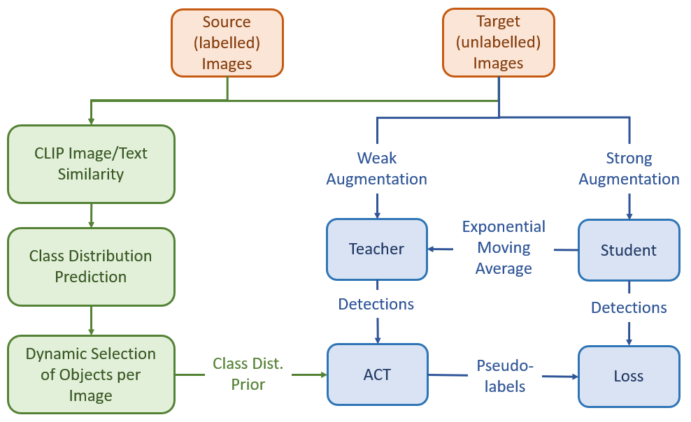
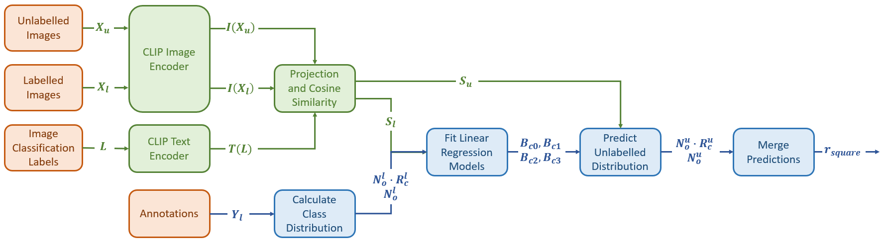

# Class Distribution Prediction for Reliable Domain Adaptive Object Detection

This reposository is the implementation of our paper Class Distribution Prediction for Reliable Adaptive Object Detection. 

## Introduction

Unsupervised domain adaptive object detection (UDA-OD) uses unlabelled data to improve the reliability of robotic vision systems in open-world environments. Previous semi-supervised learning (SSL) approaches based on Mean Teacher have been effective for UDA-OD, but the reliability of pseudo-labels remains a challenge when the labelled and unlabelled data come from different distributions. We propose changes to a recent implementation of Mean Teacher such that the contextual information available to a robot is leveraged to improve pseudo-label reliability. Our approach and how it relates to Mean Teacher and Adaptive label distribution-aware Confidence Thresholding (ACT) can be seen in the following Figure.



Shown in blue, Mean Teacher enforces consistency between a student and teacher model to improve object detection performance using unlabelled data. Confident detections from the teacher on weakly augmented data are used as pseudo-labels to improve the student on strongly augmented data. The Exponential Moving Average (EMA) of the weights of the student model are used to update the teacher to make it more stable during training. Traditionally, a static confidence threshold is defined for all classes to generate pseudo-labels. Recent work proposes Adaptive label distribution-aware Confidence Thresholding (ACT) to instead align pseudo-labels with the class distribution of the labelled data. However, using the labelled class distribution as prior is not appropriate in the case of a class distribution shift. To address this issue, we propose a method (shown in green) for predicting the class ratio of the unlabelled data using a pre-trained joint vision and language model (CLIP). Furthermore, we dynamically set the number of objects per image to ensure reliable pseudo-labels under domain shift.



Our method predicts the class ratio of unlabelled data using the semantic context extracted by a pre-trained joint vision and language model. This provides a weak supervision signal to improve the accuracy of pseudo-labels and ensures that contextual and class distribution shifts are explicitly accounted for in self-training. CLIP is used to calculate the similarity between the labelled images $X_{l}$, unlabelled images $X_{u}$, and a series of image classification labels $L$ of the form "a photo of class c". Using the labelled similarity scores $S_{l}$ as input features, two linear regression models are fit for each class to predict (1) the number of instances $N_{o}^{l} \cdot R_{c}^{l}$ and (2) the class ratio $R_{c}^{l}$ in each labelled image. Given the unlabelled similarity scores $S_{u}$, the regression models are used to generate the corresponding predictions for the unlabelled data. Lastly, the per image predictions of the number of instances $N_{o}^{u} \cdot R_{c}^{u}$ and class ratio $R_{c}^{u}$ are averaged and merged to generate a final prediction for the class ratio $r^{square}$.

## Virtual Environment

Create a virtual environment using conda and the requirements.txt file. We use Linux with Python 3.7.
```bash
conda env create --file conda_environment.yml
conda activate cdp_env
```
You will also have to install some additional packages that do not compile correctly with the yml file.
```bash
conda install -c conda-forge transformers
```
## Dataset Preparation

1. Download [cityscapes](https://cityscapes-dataset.com), [cityscapes-foggy](https://cityscapes-dataset.com) and [BDD100K](https://bdd-data.berkeley.edu) from the website and organize them as follows:

   ```shell
   # cityscapes          |    # cityscapes_foggy      |   # BDD
   /data/city            |    /data/cityscapes_foggy  |   /data/BDD
     - VOC2007_citytrain |      - VOC2007_foggytrain  |     - VOC2007_bddtrain
       - ImageSets       |        - ImageSets         |       - ImageSets
       - JPEGImages      |        - JPEGImages        |       - JPEGImages
       - Annotations     |        - Annotations       |       - Annotations 
     - VOC2007_cityval   |      - VOC2007_foggyval    |     - VOC2007_bddval 
       - ImageSets       |        - ImageSets         |       - ImageSets
       - JPEGImages      |        - JPEGImages        |       - JPEGImages
       - Annotations     |        - Annotations       |       - Annotations 
   ```
The datasets should follow the VOC format, with image annotations as xml files in the 'Annotations' folder and images with the same names in 'JPEGImages'.

2. Once the datasets are in the correct format, we organise them into the three adaptation scenarios by creating dataset links. Make sure the source directory is updated for your environment. 

   ```shell
   cd tools/datasets_uda
   xonsh create_dataset_link.sh
   ```

3. We then convert the xml files to Coco format by running:

   ```bash
   cd tools/datasets_uda
   xonsh preprocess_dataset.sh
   ```
   Additionally the script 'convert_xml_to_json.py' can be edited to use only a subset of a dataset when creating the json annotation file. We utilize this to split BDD100k into the daytime and night subsets.
   
4. You can run dataset/browse_dataset.py to visualize the annotations in the json file. Firstly, edit example_config.py so that the desired dataset is referenced. Search 'TODO' to find the lines that need updating.

5. Generate the CLIP image embeddings for performing class distribution prediction. This is done before self-training is run to speed up class distribution prediction. Edit 'cluster_priors/save_clip_embeddings.py' to define the desired source directory, scenario and dataset. when the script is run, the embeddings will be saved in the folder 'cluster_priors/clip_embeddings/'.

   ```bash
   cd cluster_priors
   python save_clip_embeddings.py
   ```

## Training

#### 1. Use labeled data to train a baseline

Before training，please download the pretrained backbone ([resnet50](https://download.pytorch.org/models/resnet50-19c8e357.pth)) to `pretrained_model/backbone`.

```shell
# |---------------------|--------|------|---------|---------|
# | xonsh train_gpu2.sh | config | seed | percent | dataset |
# |---------------------|--------|------|---------|---------|
cd examples/train/xonsh
## ---dataset: coco-standard---
xonsh train_gpu2.sh ./configs/baseline/baseline_ssod.py 1 1 coco-standard
## ---dataset: voc---
# xonsh train_gpu2.sh ./configs/baseline/baseline_ssod.py 1 1 voc
## ---dataset: coco-additional---
# xonsh train_gpu8.sh ./configs/baseline/baseline_ssod.py 1 1 coco-additional
```

- In our implementation, we use 2-gpus to train except coco-additional.

- After training, we organize the pretrained baseline to `pretrained_model/baseline` as follows：

  ```shell
  pretrained_model/
  	└── baseline/
          ├── instances_train2017.1@1.pth
          ├── instances_train2017.1@5.pth
          ├── ...
          ├── voc.pth
          └── coco.pth
  ```

  - You can also change the `load_from` information in `config` file in step 2.

#### 2. Use labeled data + unlabeled data to train detector

```shell
## note: dataset is set to none in this step.
cd examples/train/xonsh
xonsh train_gpu8.sh ./configs/labelmatch/labelmatch_standard.py 1 1 none
```

- In our implementation, we use 8-gpus to train.
- You can also run `bash train_ssod.sh` in `examples/train/bash`

### Evaluation

```shell
# please change "config" and "checkpoint" in 'eval.sh' scripts to support different dataset and trained model
cd examples/eval
xonsh eval.sh
```

## Acknowledgements
The following repository is built upon the MMDetection-based Toolbox for Semi-Supervised Object Detection. For more details, see the [repostitory](https://github.com/hikvision-research/SSOD) or the associated [paper](https://arxiv.org/abs/2206.06608).


