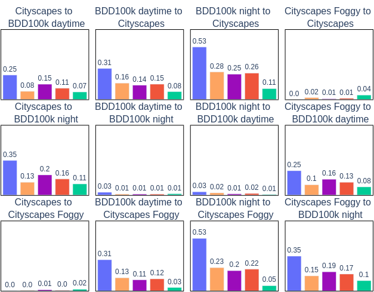
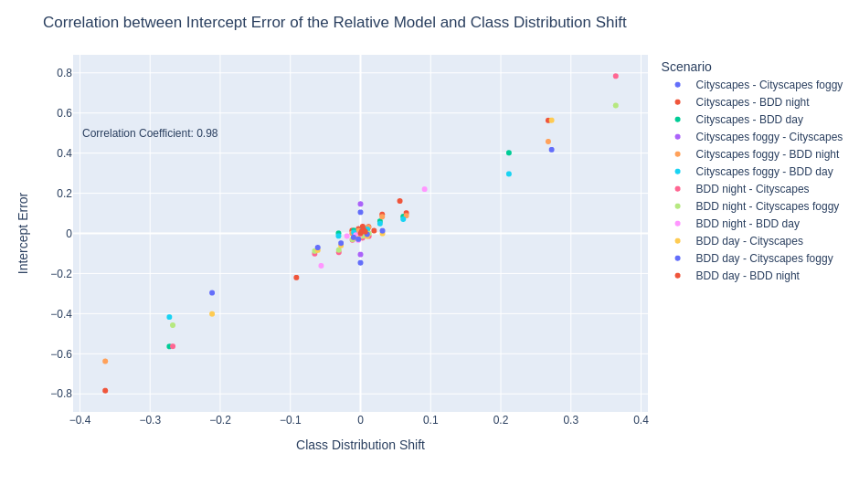

# Class Distribution Prediction for Reliable Domain Adaptive Object Detection

This reposository is the implementation of our [paper](https://arxiv.org/pdf/2302.06039.pdf) Class Distribution Prediction for Reliable Domain Adaptive Object Detection. 

## Motivation

Unsupervised Domain Adaptive Object Detection (UDA-OD) uses unlabelled data to improve the reliability of robotic vision systems in open-world environments. Previous approaches to UDA-OD based on self-training have been effective in overcoming changes in the general appearance of images. However, shifts in a robot's deployment environment can also impact the likelihood that different objects will occur, termed class distribution shift. Motivated by this, we propose a framework for explicitly addressing class distribution shift to improve pseudo-label reliability in self-training.

## Method

As per the standard implementation of Mean Teacher, confident detections from a teacher model are used as pseudo-labels to train a student model using unlabelled data. The Exponential Moving Average (EMA) of the weights of the student are then used to update the teacher to make it more stable during training. Traditionally, a static confidence threshold is defined for all classes to generate pseudo-labels. Our method (shown in green) instead predicts the class distribution of the unlabelled data, and selects confidence thresholds to align the class distribution of the pseudo-labels with this prediction. To further address the poor performance of the teacher model in the target domain, we dynamically adjust the number of pseudo-labels per image as teacher confidence increases.


The below figure shows our proposed method for predicting the class ratio of the unlabelled data. CLIP is used to calculate the similarity between the labelled images $X_{l}$ and a series of image classification labels $L$ of the form ``a photo of class $c$". Using the labelled similarity vector $s_{l}$ as a domain invariant representation of semantic context, two linear regression models are fit to predict the number of instances $g(s, \beta_{g})$ and the class ratio $k(s, \beta_{k})$ in each labelled image. To make a prediction for the class ratio of the unlabelled images $X_{u}$, CLIP is used to extract the similarity vectors $s_{u}$. The mean similarity vector $\overline{s_{u}}$ is then calculated and input to the linear regression models to generate two distinct predictions for the class ratio of the entire unlabelled dataset. These predictions are merged by calculating the geometric mean, and the relative change in class ratio squared to account for persistent underestimation.


## Experiments and Results
We test our method on the following UDA-OD scenarios:
* Adaptation from small to large scale dataset (C2B): we use Cityscapes is the small source dataset, and BDD100k daytime as the large and diverse target domain.
* Adaptation from normal to foggy weather (C2F): this commonly studies scenario used Cityscapes as the source domain and Foggy Cityscapes as the target domain.
* Adaptation from daytime to night (C2N): to study more extreme class distribution shift, we utilise Cityscapes as the source domain and BDD100k night as the target domain.

Our approach returns state-of-the-art performance on these scenarios:

|              | C2B (mAP) | C2N (mAP) | C2F (mAP) |
| --------     | -------   | -------   | -------   |
| Source only  | 20.6      |    3.8    |    24.8   |
| CDP (Ours)   | 39.2      |    24.2   |    47.1   |
| Target Only  | 51.7      |    32.7   |    46.3   |

## Additional Ablations
We include here additional results that are supplementary to the released paper. We have conducted additional studies that motivate the use of the merged and squared prediction in our method. Firstly, we present the following figure comparing the class distribution prediction accuracy of the relative and absolute regression models. This figure is identical to Figure 4 in our [paper](https://arxiv.org/pdf/2302.06039.pdf), with the addition of the relative model accuracy in orange and the absolute model accuracy in purple. 



The absolute and relative regression models produce distinct predictions for the class ratio, either of which can be used by our framework. It can be seen in the above ablations that neither prediction is consistently more accurate than the other across the driving scenarios. For example, the relative model performs extremely well on the Cityscapes to BDD100k daytime example, but relatively poorly on the BDD100k night to Cityscapes scenario. Furthermore, it cannot be determined which model will perform optimally on a given scenario without access to labelled target data. We therefore average the output of the two models to produce the merged prediction, the accuracy of which tends to fall between that of the absolute and relative models. This prediction thus exhibits much more consistent performance across all scenarios without sacrificing accuracy. This consistency ultimately allows us to offer a stronger guarantee that our framework will perform well on novel scenarios.

We also investigate the regression models to ascertain why the squared prediction is consistently more accurate than the merged prediction. We present here a plot showing the correlation between the intercept error of the regression models and the class distribution shift. We assess the correlation for the relative model across all combinations of the driving scenarios utilised in Figure 4 of the paper. There are seven samples per scenario, denoting the intercept error and distribution shift of each class in the datasets. 



We find that the intercept coefficients of the regression models vary significantly across datasets. This implies that the class ratio is influenced by exogenous factors not captured by the CLIP similarity scores. As a result, a model fit to the labelled data will consistently be in error when making predictions on the shifted, unlabelled data. However, this intercept error is strongly correlated with the class distribution shift between the datasets ($r = 0.98$). Thus, by predicting the relative change in class ratio between datasets, we are indirectly estimating the intercept error. Scaling up the predicted change in class ratio therefore improves accuracy by incorporating this prediction of the intercept error into our method. 

## Virtual Environment

Create a virtual environment using conda and the requirements.txt file. We use Linux with Python 3.7.
```bash
conda env create --file conda_environment.yml
conda activate cdp_env
```
## Dataset Preparation

1. Download [cityscapes](https://cityscapes-dataset.com), [cityscapes-foggy](https://cityscapes-dataset.com) and [BDD100K](https://bdd-data.berkeley.edu) from the website and organize them as follows:

   ```shell
   # cityscapes          |    # cityscapes_foggy      |   # BDD
   /data/city            |    /data/cityscapes_foggy  |   /data/BDD
     - VOC2007_citytrain |      - VOC2007_foggytrain  |     - VOC2007_bddtrain
       - ImageSets       |        - ImageSets         |       - ImageSets
       - JPEGImages      |        - JPEGImages        |       - JPEGImages
       - Annotations     |        - Annotations       |       - Annotations 
     - VOC2007_cityval   |      - VOC2007_foggyval    |     - VOC2007_bddval 
       - ImageSets       |        - ImageSets         |       - ImageSets
       - JPEGImages      |        - JPEGImages        |       - JPEGImages
       - Annotations     |        - Annotations       |       - Annotations 
   ```
   - The datasets should follow the VOC format, with image annotations as xml files in the 'Annotations' folder and images with the same names in 'JPEGImages'.

2. Once the datasets are in the correct format, we organise them into the three adaptation scenarios by creating dataset links. Make sure the source directory is updated for your environment. 

   ```shell
   cd tools/datasets_uda
   xonsh create_dataset_link.sh
   ```

3. We then convert the xml files to Coco format by running:

   ```bash
   cd tools/datasets_uda
   xonsh preprocess_dataset.sh
   ```
   - Additionally the script 'convert_xml_to_json.py' can be edited to use only a subset of a dataset when creating the json annotation file. We utilize this to split BDD100k into the daytime and night subsets.
   
4. You can run dataset/browse_dataset.py to visualize the annotations in the json file. Firstly, edit example_config.py so that the desired dataset is referenced. Search 'TODO' to find the lines that need updating.

5. Generate the CLIP image embeddings for performing class distribution prediction. This is done before self-training is run to speed up class distribution prediction. Edit 'cluster_priors/save_clip_embeddings.py' to define the desired source directory, scenario and dataset. When the script is run, the embeddings will be saved in the folder 'cluster_priors/clip_embeddings'.

   ```bash
   cd cluster_priors
   python save_clip_embeddings.py
   ```

## Training

1. Download the pretrained backbone ([vgg](https://www.dropbox.com/s/s3brpk0bdq60nyb/vgg16_caffe.pth?dl=0)) and save it to 'pretrained_model/backbone/'.

2. Train a model using the labeled source data only. If training to convergence, we use 48,000 iterations. However, when training to use as a checkpoint for initialising the teacher we run for 4000 iterations only. 

   ```bash
   cd bash_scripts
   bash train_uda_baseline.sh
   ```

   - You may need to change the number of GPUs in the bash script and the number of samples_per_gpu in the config file for this to work on your system. We use 1 GPU and 16 samples per GPU for training the baseline models.
   - The scenario can be edited in the bash script.

3. Save the resulting model to `pretrained_model/baseline` as follows：

   ```shell
   pretrained_model/
  	 └── baseline/
           ├── C2B.pth
   ```
4. To train a model using LabelMatch with the original ACT, run the script 'train_labelmatch.sh'.
   
   ```bash
   cd bash_scripts
   bash train_labelmatch.sh
   ```
   - We use 2 GPUs and 8 samples per GPU for our experiments.
   - The scenario can be edited in the bash script.

5. To train a model using our method, run the script 'train_labelmatch_cluster.sh'.
   
   ```bash
   cd bash_scripts
   bash train_labelmatch_cluster.sh
   ```
   - We use 2 GPUs and 8 samples per GPU for our experiments.
   - The scenario can be edited in the bash script.

6. Lastly, we provide a means to run class distribution prediction and visualise the results separately to self-training. Simply run the following:

   ```bash
   cd cluster_priors
   python distance_prior_regression.py --labeled_dataset C2B --labeled_data labeled_data  --unlabeled_dataset C2B --unlabeled_data unlabeled_data --dir 'your_directory/class_distribution_prior/'
   ```
   - The input arguments to the script can be used to change the adaptation scenario.

## Evaluation
We provide a script for evaluating a trained model on the validation dataset defined by a config file. Please change "config" and "checkpoint" in 'eval.sh' scripts to support different dataset and trained model.   
   
   ```shell 
   cd examples/eval
   xonsh eval.sh
   ```

## Acknowledgements
The following repository is built upon the MMDetection-based Toolbox for Semi-Supervised Object Detection. For more details, see the [repostitory](https://github.com/hikvision-research/SSOD) or the associated [paper](https://arxiv.org/abs/2206.06608).


